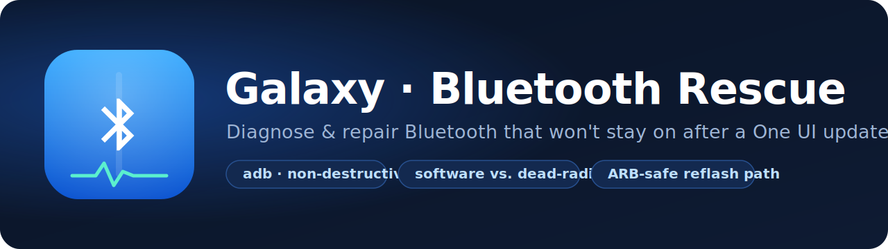

<p align="center">
  
</p>

<p align="center">
  <a href="LICENSE"></a>
  
  
  
</p>

# Samsung Galaxy — Bluetooth Diagnostic & Rescue

A guided, **non-destructive-first** toolkit for diagnosing and (where possible) repairing
Bluetooth on **Samsung Galaxy** phones — built for and validated on the **Galaxy Z Fold**
family, and applicable across Galaxy **S / Note / A / Z** — that, after a software update,
show one or more of:

- Bluetooth **won't stay on** (toggles itself back off within seconds), and/or
- **About phone → Status → Bluetooth address = "Unavailable"** (no MAC shown), and/or
- a Bluetooth **crash loop** chewing battery in the background.

It drives everything over **`adb`** (USB), captures evidence to `logs/`, and walks you to a
clear verdict: **software/config fault → fixed locally**, or **firmware/radio fault → a
guided firmware reinstall**, or **hardware fault → service centre with evidence in hand.**

> **Searched for** *"Galaxy Z Fold Bluetooth not working", "Samsung Bluetooth won't stay on
> after update", "Bluetooth address unavailable", "One UI Bluetooth keeps turning off",
> "Bluetooth crashing after One UI update"*? You're in the right place.

> Built and validated on a **Galaxy Z Fold 5 (SM-F946U1)** after a One UI 8.5 update. The
> method generalizes across the Z Fold family (SM-F9xx) and most Qualcomm "combo-chip"
> Samsungs — adapt the model/CSC strings to your device.

---

## ⚠️ Read this first (safety)

- **`adb` cannot and will not flash firmware here.** Every script in `scripts/` is read-only
  *except* `03_bluetooth_repair.sh --hard`, which clears Bluetooth pairings. Firmware
  reinstall/rollback is an **external, manual** step (Odin/Heimdall/Thor) you do yourself.
- **Back up before any destructive step.** A data clear wipes pairings; a firmware flash can
  wipe everything; **an interrupted flash can permanently brick the phone.**
- **Do not root.** Nothing here needs it; rooting trips Knox and voids warranty.
- **Prefer a same-version reinstall over a downgrade.** It is anti-rollback-safe and lower
  risk — see [Reflash vs. rollback](#reflash-vs-rollback).
- This is a **community tool provided "AS IS", with no warranty** (Apache-2.0). You assume
  all risk. Not affiliated with Samsung/Google/Qualcomm.

---

## Who this is for

You have a Z Fold whose Bluetooth broke (often right after an OTA), you're comfortable
running a few terminal commands, and you want to **know whether it's fixable before** you
risk a firmware flash or pay for a repair.

You'll need: a **Mac or Linux** (or WSL) machine with `adb`, a **USB data cable**, and the
phone with **USB debugging** enabled.

---

## Requirements

- A **Mac or Linux** machine (or Windows + WSL) with **`adb`** — `scripts/00_setup_mac.sh`
  installs/verifies it.
- A **USB data cable** and the phone with **USB debugging** enabled.
- **On the phone first (one time):** Settings → About phone → Software info → tap **Build
  number** 7× → back → Developer options → enable **USB debugging** → plug in → tap **Allow**.

## How to run it — pick your driver

Everything (the phased plan, the hard safety guardrails, and the decision tree) lives in
[`CLAUDE.md`](CLAUDE.md) — mirrored by [`AGENTS.md`](AGENTS.md) for agents that look for that
filename. You can let an AI coding agent drive it, or run it by hand.

### ▶ With Claude Code
Open this folder in Claude Code and tell it:
> *"Read CLAUDE.md and start at Phase 0. Walk me through it, and stop before anything destructive."*

### ▶ With ChatGPT Codex (or Cursor, or any other coding agent)
Point the agent at this repo and tell it:
> *"Read AGENTS.md / CLAUDE.md and follow the phased plan: run `scripts/00` through `04` in
> order, save logs to `./logs`, interpret with the decision tree, and **stop to ask me before
> any destructive step** (`03 --hard` or a firmware flash)."*

### ▶ Manually
```bash
git clone <your-fork-url> && cd <repo>
chmod +x scripts/*.sh          # first time only

./scripts/00_setup_mac.sh      # verify/install adb
./scripts/01_connect_check.sh  # inventory: model, firmware, CSC, bootloader idx, BT state
./scripts/03_bluetooth_repair.sh --soft   # non-destructive: reset stack + reboot (keeps pairings)
./scripts/02_capture_logcat.sh # capture a Bluetooth logcat while you toggle BT
./scripts/04_firmware_check.sh # read-only anti-rollback (ARB) / reflash feasibility
```

---

## The diagnostic flow

The single most useful thing this toolkit does is tell two very different failures apart,
because they look identical in the Settings UI ("Bluetooth address: Unavailable") but need
opposite responses:

```
adb shell dumpsys bluetooth_manager
adb shell getprop vendor.bluetooth_init_fail        # 0 = OK; nonzero/climbing = controller init failing
adb shell getprop sys.init.updatable_crashing_process_name
```

| What you observe | Likely cause | What fixes it |
|---|---|---|
| Address populates after `--hard` clear + reboot, BT stays on | Corrupted BT **app data**/pairings | ✅ Done — re-pair devices |
| Address shows, but BT still drops | App/service conflict | Safe-mode test + Reset network settings |
| Stuck `BLE_TURNING_ON`, HAL "service not declared / not found", `init_fail` climbing, `pm clear` doesn't help, **Wi-Fi on the same chip still works** | **Firmware/HAL controller-init failure** (often OTA-corrupted vendor partition) | Same-version **reflash** (not a downgrade) |
| Same as above but a clean reflash still fails | **Radio/EFS or BT-core hardware fault** | Samsung service centre (bring your `logs/`) |

See [`examples/`](examples/) for a **real, redacted** capture of the firmware/HAL-init-failure
case (the `BluetoothSystemServer ... Reason is CRASH` loop + `init_fail`), so you can
recognize the signature on your own device.

Full decision tree and phase-by-phase plan: [`CLAUDE.md`](CLAUDE.md).

---

## Reflash vs. rollback

If it's a firmware fault, **reinstalling the *same* build you're already on** is almost always
the right first move — and it's very different from a *rollback* (downgrade):

| | Same-version reflash ✅ | Rollback / downgrade ⚠️ |
|---|---|---|
| **Anti-rollback (ARB)** | Same bootloader index → **no gate** | Needs an older build with index ≥ current; often **blocked** |
| **Data** | `HOME_CSC` keeps your data | Usually **force-wipes** |
| **Brick risk** | Lower | Higher |
| **Fixes OTA corruption?** | Yes — lays down clean partitions | Maybe — and may not fix a radio/NV fault at all |

**Anti-rollback (ARB)** is Samsung's one-way bootloader counter: you can only flash firmware
whose bootloader index is **≥** your current one. `04_firmware_check.sh` reads your index so
you know *before* downloading anything whether a downgrade is even possible.

Guides: [`notes/reflash-same-version.md`](notes/reflash-same-version.md) (recommended) and
[`notes/rollback-guide.md`](notes/rollback-guide.md) (last resort).

---

## Compatibility

Built and validated on a **Galaxy Z Fold 5 (SM-F946U1, Snapdragon)** — but most of it reaches
much further:

| Step | Z Fold | Any Samsung Galaxy | Any Android | Notes |
|---|:--:|:--:|:--:|---|
| `00` adb setup | ✅ | ✅ | ✅ | device-agnostic |
| `01` inventory | ✅ | ✅ | ⚠️ | model/build/BT-address are generic AOSP; **CSC** fields are Samsung-only |
| `02` logcat capture | ✅ | ✅ | ✅ | generic |
| `03` BT repair (`--soft` / `--hard`) | ✅ | ✅ | ✅ | acts on `com.android.bluetooth` (standard AOSP) |
| `04` ARB / reflash feasibility | ✅ | ✅ | ❌ | Samsung-only: CSC, version string, anti-rollback, Odin |
| reflash / rollback guides | ✅ | ✅ | ❌ | Odin / Heimdall + ARB are Samsung-specific |

- **Phases 0–3 (diagnose + non-destructive repair)** work on essentially **any Android phone**.
- **Phases 4–5 (firmware ARB / reflash / rollback)** apply to **any Samsung Galaxy** — S, Note,
  A, and Z all use CSC + Odin + anti-rollback — not just Folds.
- **Chip-level signature:** the exact props we key on — `vendor.bluetooth_init_fail`,
  `persist.vendor.qcom.bluetooth.soc`, `vendor.bluetooth-1-1-qti` — are **Qualcomm/QTI**
  (Snapdragon models). **Exynos** variants hit the same failure but expose different prop
  names; the generic signals (`dumpsys bluetooth_manager` stuck at `BLE_TURNING_ON`, the crash
  loop, the HAL "service not declared" error) are OEM-agnostic, so the **method still applies**.

## Repository layout

```
scripts/   00 setup · 01 inventory · 02 logcat · 03 repair(--soft/--hard) · 04 ARB check · lib.sh
notes/     reflash-same-version.md (recommended) · rollback-guide.md (last resort)
examples/  redacted real captures showing the firmware/HAL-init-failure signature
logs/      YOUR captures land here — gitignored, never published (they hold serial + BT MAC)
CLAUDE.md  operating context, guardrails, and decision tree (also the Claude Code agent plan)
```

---

## Privacy

Your own `logs/` contain device identifiers (serial, Bluetooth MAC, possibly paired-device
names). They are **gitignored** and never committed. If you share logs for help, **redact**
your serial and MAC first (the files in `examples/` show the expected redaction style).

---

## Contributing

Issues and PRs welcome — especially confirmed `init_fail` codes, build/CSC combinations, and
whether a same-version reflash resolved your case (it helps others triage). See
[`CONTRIBUTING.md`](CONTRIBUTING.md).

## Credits

Created and maintained by contributors to
**[DevForgeAtlas-Org](https://github.com/DevForgeAtlas-Org)**. Community data points and PRs
are what make the decision tree better — see [`CONTRIBUTING.md`](CONTRIBUTING.md).

## License

[Apache-2.0](LICENSE). Provided "AS IS", without warranty of any kind. Use at your own risk.
